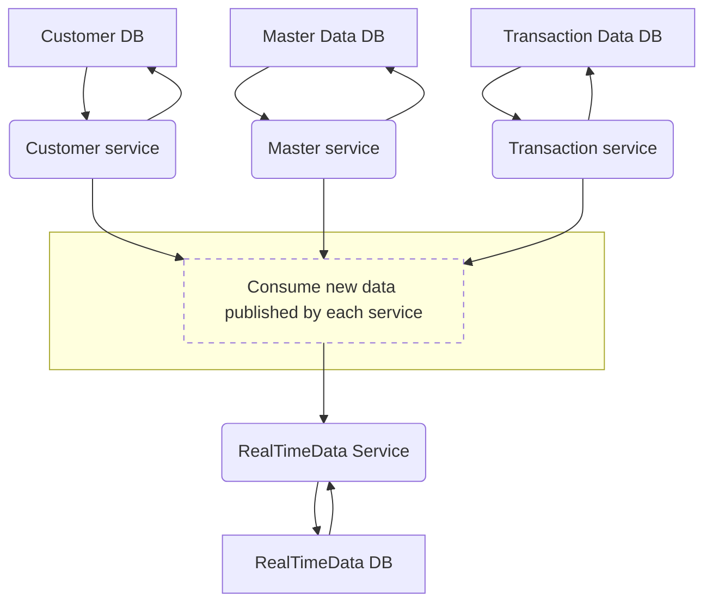

# h-lab-pre-assessment

## Backend Question
#### 1 Assuming the system currently has three microservices: Customer API, Master Data API,and Transaction Data API, there is a new feature that requires data from all three microservices to be displayed in near real-time. The current technology stack includesREST APIs and an RDBMS database. How would you design a new API for this feature?



From above diagram: 
- I'm designing a new API with a RealTimeData Service at its core. This service subscribes to data updates from the Customer, Master, and Transaction services. When any of these services publish new data, the RealTimeData Service processes it and stores it in a dedicated database. This architecture eliminates the need for clients to make repeated API calls to each individual service, minimizing latency and ensuring efficient data retrieval.
---

#### 2 Assuming the team has started planning a new project, the project manager asks you for a performance test strategy plan for this release. How would you recommend proceeding to the project manager?


----

#### 3 Design and develop two APIs using NestJS and Postgres with the following
specifications:
- Create a Multilingual Product API: Develop an API that allows for the creation
of products, each with attributes for name and description that support multiple
languages.
- Multilingual Product Search API: Implement an API that enables searching for
products by name in any language and returns results in a paginated format.

Additional Requirements:
- Validation: Outline how you will validate data inputs in both APIs to ensure data
integrity.

- Database Design: Describe the database schema and the approach you will use to
handle multilingual support for product information.

    | Column | Data Type | Constraints |
    |---|---|---|
    | id | number | Primary Key |
    | name | string |  |
    | description | string |  |

- Testing Strategy: Explain your strategy for testing these APIs, including how you
will handle unit tests, integration tests, and any end-to-end testing considerations.

Unit Tests:
> Focus on individual functions, methods, or classes

Integration Tests:
> Ensure that different parts of the application, like services and repositories, work together correctly.

End-to-End Tests:
> Validate the entire API flow, focusing on the API's response to incoming requests and its overall functionality.

I've developed new APIs within the `./product-service` directory.

To explore and test these APIs, follow these steps:

1. **Start the service:**

   ```bash
   docker-compose up --build 
   ```

2. **Access the API documentation:**

   Open your browser and navigate to 
   > `http://localhost:3000/api#/products`. 
   
   This will provide detailed information about the available endpoints and how to use them.

**Running Tests**

You can also run various tests to ensure the APIs are functioning correctly:

**Unit Tests:** 
> `npm run test`

**End-to-End Tests:** 
> `npm run test:e2e`

**Integration Tests:** 
> `npm run test:repository`